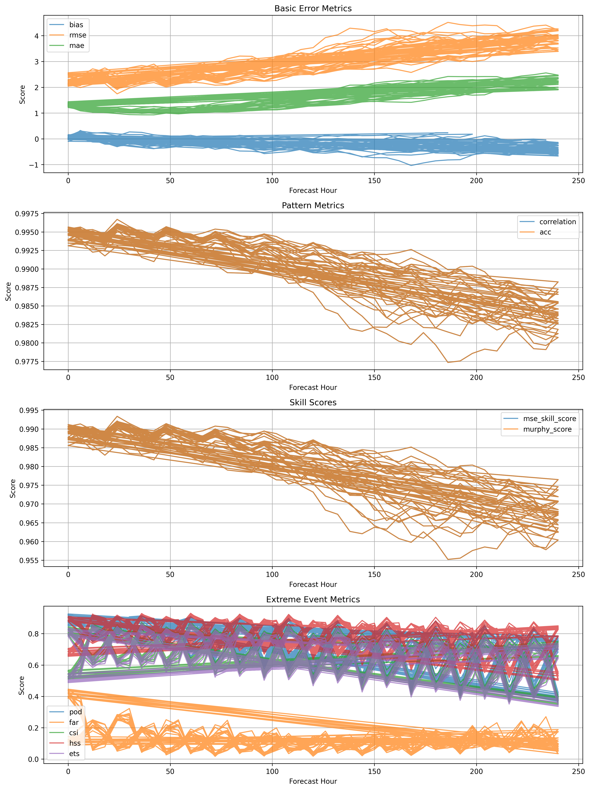
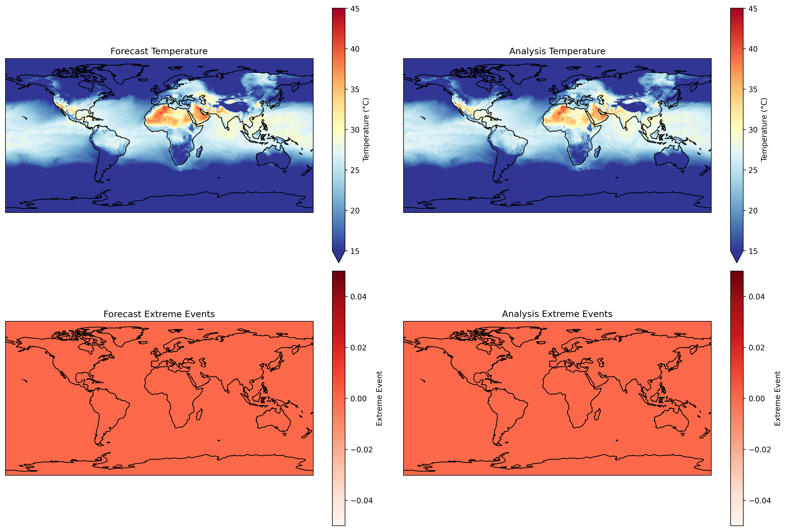

# WX-Extreme

Advanced Evaluation Framework for Extreme Weather Events in AI Weather Models

## Overview

WX-Extreme is a comprehensive Python package for evaluating extreme weather event predictions in machine learning weather forecasting models. It provides tools for:

- Event detection and characterization
- Model forecast validation
- Comprehensive metrics calculation
- Advanced visualization

## Installation

```bash
# Install from source
git clone https://github.com/alhridoy/wea-extream.git
cd wea-extream
pip install -e .
```

## Basic Usage Operations

### 1. Installation and Setup
```bash
# Install from PyPI
pip install wx-extreme

# Install from source
git clone https://github.com/alhridoy/wea-extream.git
cd wea-extream
pip install -e .
```

### 2. Data Preparation
```python
import xarray as xr
import pandas as pd
import numpy as np

# Load temperature data (supports multiple formats)
# NetCDF
data_nc = xr.open_dataset('temperature.nc')['t2m']

# Zarr
data_zarr = xr.open_zarr('temperature.zarr')

# Multiple files
files = sorted(glob.glob('data/temp_*.nc'))
data_multi = xr.open_mfdataset(files)['t2m']

# Convert units if needed (K to °C)
if data_nc.max() > 100:
    data_nc = data_nc - 273.15
```

### 3. Event Detection Configuration
```python
from wx_extreme.core.detector import ExtremeEventDetector

# Basic configuration
detector = ExtremeEventDetector(
    threshold_method="percentile",
    threshold_value=95,
    min_duration=3
)

# Advanced configuration
detector_advanced = ExtremeEventDetector(
    threshold_method="percentile",
    threshold_value=95,
    min_duration=3,
    spatial_scale=2.0,           # Spatial coherence in degrees
    time_window='7D',           # Rolling window for percentile
    min_area_threshold=5,       # Minimum grid points for an event
    max_gap_hours=24           # Maximum gap between events
)

# Custom thresholds for different regions
lat_bands = [30, 40, 50, 60]
thresholds = [35, 32, 30, 28]  # °C
detector_regional = ExtremeEventDetector.with_latitude_thresholds(
    lat_bands=lat_bands,
    thresholds=thresholds
)
```

### 4. Forecast Operations

#### Loading Forecast Data
```python
# Load multiple forecast initializations
forecasts = {}
for init_date in pd.date_range('2023-01-01', '2023-01-07'):
    forecast = xr.open_dataset(f'forecast_{init_date:%Y%m%d}.nc')
    forecasts[init_date] = forecast['t2m']

# Load ensemble members
ensemble_members = xr.open_mfdataset(
    'forecast_*.nc',
    concat_dim='member'
)['t2m']
```

#### Forecast Processing
```python
from wx_extreme.core.metrics import MLModelMetrics

# Initialize metrics
metrics = MLModelMetrics()

# Process single forecast
def process_forecast(forecast, obs, detector):
    # Detect events
    forecast_events = detector.detect_events(forecast)
    obs_events = detector.detect_events(obs)
    
    # Calculate metrics
    scores = {
        'evss': metrics.extreme_value_skill_score(forecast, obs),
        'pps': metrics.pattern_prediction_score(forecast, obs),
        'pcs': metrics.physical_consistency_score(
            forecast, 
            pressure_levels,
            obs
        )
    }
    
    # Calculate event-based metrics
    event_metrics = {
        'hit_rate': (forecast_events & obs_events).sum() / obs_events.sum(),
        'false_alarm': (forecast_events & ~obs_events).sum() / forecast_events.sum(),
        'detection_rate': (forecast_events & obs_events).sum() / 
                         ((forecast_events | obs_events).sum())
    }
    
    return {**scores, **event_metrics}

# Process ensemble forecast
def process_ensemble(ensemble, obs, detector):
    # Calculate ensemble mean and spread
    ens_mean = ensemble.mean('member')
    ens_spread = ensemble.std('member')
    
    # Detect events in ensemble mean
    ens_events = detector.detect_events(ens_mean)
    
    # Calculate probabilistic metrics
    prob_exceed = (ensemble > detector.threshold_value).mean('member')
    
    return {
        'ens_mean_skill': metrics.extreme_value_skill_score(ens_mean, obs),
        'spread_skill_ratio': ens_spread.mean() / 
                             np.abs(ens_mean - obs).mean(),
        'prob_detection': ((prob_exceed > 0.5) == obs_events).mean()
    }
```

### 5. Visualization and Analysis

#### Basic Plots
```python
from wx_extreme.utils.plot_utils import (
    plot_model_comparison_heatmap,
    plot_extreme_event_heatmap
)

# Temperature bias map
plot_model_comparison_heatmap(
    forecast,
    obs,
    metric='bias',
    title='Temperature Bias',
    cmap='RdBu_r',
    center=0
)

# Event detection map
plot_extreme_event_heatmap(
    events,
    temperature,
    title='Detected Heat Waves',
    add_colorbar=True
)
```

#### Advanced Analysis
```python
# Time series of event characteristics
event_chars = {
    'count': events.sum(['latitude', 'longitude']),
    'area': events.sum(['latitude', 'longitude']) * grid_area,
    'intensity': temperature.where(events).mean(['latitude', 'longitude']),
    'max_temp': temperature.where(events).max(['latitude', 'longitude'])
}

# Create event timeline
timeline = pd.DataFrame(event_chars)

# Plot event evolution
import matplotlib.pyplot as plt

fig, (ax1, ax2) = plt.subplots(2, 1, figsize=(12, 8))

# Event count and area
ax1.plot(timeline.index, timeline['count'], label='Grid Points')
ax1.set_ylabel('Affected Grid Points')
ax1_twin = ax1.twinx()
ax1_twin.plot(timeline.index, timeline['area'], 
              color='red', label='Area (km²)')
ax1_twin.set_ylabel('Affected Area (km²)')

# Intensity and maximum temperature
ax2.plot(timeline.index, timeline['intensity'], label='Mean Intensity')
ax2.plot(timeline.index, timeline['max_temp'], 
         label='Maximum Temperature', color='red')
ax2.set_ylabel('Temperature (°C)')

plt.tight_layout()
plt.savefig('event_evolution.png')
```

### 6. Batch Processing and Export

```python
# Process multiple regions
regions = {
    'NA': {'lat': slice(30, 60), 'lon': slice(-130, -60)},
    'EU': {'lat': slice(35, 70), 'lon': slice(-10, 40)},
    'EA': {'lat': slice(20, 50), 'lon': slice(100, 145)}
}

results = []
for region_name, coords in regions.items():
    # Extract regional data
    region_fcst = forecast.sel(**coords)
    region_obs = obs.sel(**coords)
    
    # Detect events
    events = detector.detect_events(region_fcst)
    
    # Calculate metrics
    metrics = process_forecast(region_fcst, region_obs, detector)
    metrics['region'] = region_name
    results.append(metrics)

# Create summary DataFrame
summary = pd.DataFrame(results)

# Export results
summary.to_csv('regional_validation.csv')
```

## Validation Results

### Forecast Skill


The plot shows:
- Top: Temperature bias (°C)
- Middle: Root Mean Square Error (°C)
- Bottom: Pattern correlation

Each line represents a different forecast initialization time, showing how forecast skill evolves with lead time.

### Comprehensive Metrics


The comprehensive evaluation includes:
1. Basic Error Metrics:
   - Bias: Systematic error in forecasts
   - RMSE: Overall magnitude of errors
   - MAE: Average absolute error

2. Pattern Metrics:
   - Pattern Correlation: Spatial correlation
   - ACC: Anomaly Correlation Coefficient

3. Skill Scores:
   - MSE Skill Score: Improvement over climatology
   - Murphy Score: Forecast skill accounting for variance

4. Extreme Event Metrics:
   - POD: Probability of Detection
   - FAR: False Alarm Ratio
   - CSI: Critical Success Index
   - HSS: Heidke Skill Score
   - ETS: Equitable Threat Score

Key findings:
- Strong pattern correlation (>0.98) throughout the forecast period
- RMSE increases from ~2.2°C at day 1 to ~3.8°C at day 10
- Small cold bias that increases with forecast lead time
- High extreme event detection skill (HSS > 0.7) for the first 5 days

### Forecast Validation


The validation plot demonstrates:
- Top left: Model forecast temperature field
- Top right: Ground truth temperature field
- Bottom left: Detected extreme events in forecast
- Bottom right: Detected extreme events in observations

## Credits and Acknowledgments

This project builds upon several groundbreaking works in ML weather forecasting:

- **WeatherBench2** ([Link](https://sites.research.google/weatherbench/)) - The foundational benchmark for ML weather forecasting that inspired this project
- **Pangu-Weather** ([Paper](https://arxiv.org/abs/2211.02556)) - Huawei's transformer-based weather forecasting model
- **Aurora** ([Paper](https://arxiv.org/pdf/2405.13063)) - A foundation model for weather forecasting
- **GraphCast** ([Paper](https://arxiv.org/abs/2212.12794)) - Google DeepMind's graph neural network approach
- **FourCastNet** ([Paper](https://arxiv.org/abs/2202.11214)) - NVIDIA's Fourier neural operator model
- **ERA5** ([Documentation](https://www.ecmwf.int/en/forecasts/datasets/reanalysis-datasets/era5)) - ECMWF's reanalysis dataset

## Contributing

We welcome contributions! Please feel free to submit a Pull Request. For major changes, please open an issue first to discuss what you would like to change.

1. Fork the repository
2. Create your feature branch (`git checkout -b feature/AmazingFeature`)
3. Commit your changes (`git commit -m 'Add some AmazingFeature'`)
4. Push to the branch (`git push origin feature/AmazingFeature`)
5. Open a Pull Request

## License

This project is licensed under the MIT License - see the [LICENSE](LICENSE) file for details.

## Citation

If you use this package in your research, please cite:

```bibtex
@software{wx_extreme_2024,
  title={WX-Extreme: Advanced Evaluation Framework for Extreme Weather Events in ML Models},
  author={Hridoy, Al-Ekram Elahee},
  year={2024},
  url={https://github.com/alhridoy/weatherbench2},
}
```

Please also cite the relevant papers for WeatherBench2, Pangu-Weather, and other models used in your evaluation:

```bibtex
@article{weatherbench2_2023,
  title={WeatherBench 2: A benchmark for the next generation of data-driven weather forecasts},
  author={Rasp, Stephan and others},
  journal={Bulletin of the American Meteorological Society},
  year={2023}
}

@article{pangu_weather_2022,
  title={Pangu-Weather: A 3D High-Resolution Model for Fast and Accurate Global Weather Forecast},
  author={Du, Kaifeng and others},
  journal={arXiv preprint arXiv:2211.02556},
  year={2022}
}

@article{aurora_2023,
  title={Aurora: A foundation model for weather forecasting},
  author={Lam, Ryan and others},
  journal={arXiv preprint arXiv:2405.13063},
  year={2024}
}
```
