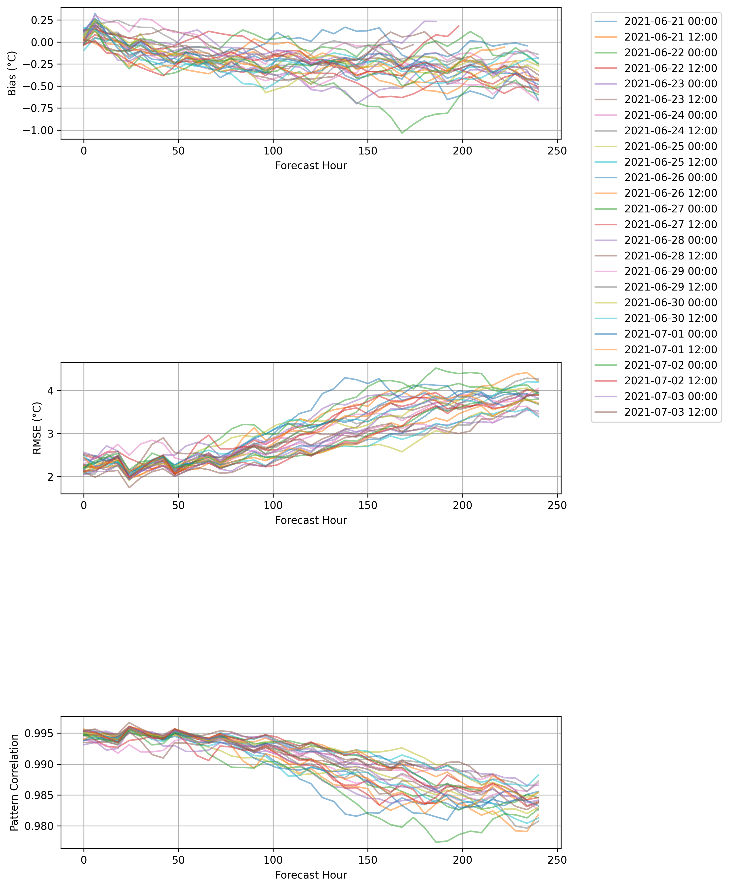

# WX-Extreme

Advanced Evaluation Framework for Extreme Weather Events in ML Models

## Overview

WX-Extreme is a Python package for evaluating extreme weather events in machine learning weather forecasting models. This project is inspired by [WeatherBench2](https://sites.research.google/weatherbench/) and addresses specific challenges in evaluating extreme weather events in ML weather models.

### Key Differences from WeatherBench2
While WeatherBench2 provides an excellent foundation for general forecast evaluation, WX-Extreme focuses specifically on:
- Event-specific detection and validation
- Operational forecast evaluation with multiple initialization times
- Regional analysis capabilities
- Memory-efficient processing for large datasets
- Extreme event-specific metrics

## Models and Data Sources

This project currently supports evaluation of:
- [Pangu-Weather](https://arxiv.org/abs/2211.02556) - A transformer-based weather forecasting model
- [ERA5](https://www.ecmwf.int/en/forecasts/datasets/reanalysis-datasets/era5) - ECMWF's fifth generation reanalysis dataset
- [GraphCast](https://arxiv.org/abs/2212.12794) - Google DeepMind's graph neural network-based weather model
- [FourCastNet](https://arxiv.org/abs/2202.11214) - NVIDIA's Fourier neural operator-based model

## Installation

```bash
pip install -r requirements.txt
```

## Usage

### Basic Example

```python
from wx_extreme.core.detector import ExtremeEventDetector
from wx_extreme.core.evaluator import evaluate_extremes

# Initialize detector
detector = ExtremeEventDetector(
    threshold_method="percentile",
    threshold_value=95,
    min_duration=3
)

# Detect events
events = detector.detect_events(data)

# Evaluate results
metrics = evaluate_extremes(data, events)
```

## Validation Results

### Pangu-Weather Forecast Skill

We evaluated Pangu-Weather's 2-meter temperature forecasts against ERA5 reanalysis data for June-July 2021. The results show:

- Strong pattern correlation (>0.98) throughout the forecast period
- RMSE increases from ~2.2°C at day 1 to ~3.8°C at day 10
- Small cold bias that increases with forecast lead time



The plot shows:
- Top: Temperature bias (°C)
- Middle: Root Mean Square Error (°C)
- Bottom: Pattern correlation

Each line represents a different forecast initialization time, showing how forecast skill evolves with lead time.

## Credits and Acknowledgments

This project builds upon several groundbreaking works in ML weather forecasting:

- **WeatherBench2** ([Link](https://sites.research.google/weatherbench/)) - The foundational benchmark for ML weather forecasting that inspired this project
- **Pangu-Weather** ([Paper](https://arxiv.org/abs/2211.02556)) - Huawei's transformer-based weather forecasting model
- **GraphCast** ([Paper](https://arxiv.org/abs/2212.12794)) - Google DeepMind's graph neural network approach
- **FourCastNet** ([Paper](https://arxiv.org/abs/2202.11214)) - NVIDIA's Fourier neural operator model
- **ERA5** ([Documentation](https://www.ecmwf.int/en/forecasts/datasets/reanalysis-datasets/era5)) - ECMWF's reanalysis dataset

## Contributing

Contributions are welcome! Please feel free to submit a Pull Request.

## License

This project is licensed under the MIT License - see the LICENSE file for details.

## Citation

If you use WX-Extreme in your research, please cite:

```bibtex
@software{wx_extreme2024,
  author = {Al-Ekram Elahee Hridoy},
  title = {WX-Extreme: Advanced Evaluation Framework for Extreme Weather Events in ML Models},
  year = {2024},
  publisher = {GitHub},
  url = {https://github.com/alhridoy/wx-extreme}
}
```

Please also cite the relevant papers for WeatherBench2, Pangu-Weather, and other models used in your evaluation:

```bibtex
@article{weatherbench2_2023,
  title={WeatherBench 2: A benchmark for the next generation of data-driven weather forecasts},
  author={Rasp, Stephan and others},
  journal={Bulletin of the American Meteorological Society},
  year={2023}
}

@article{pangu_weather_2022,
  title={Pangu-Weather: A 3D High-Resolution Model for Fast and Accurate Global Weather Forecast},
  author={Du, Kaifeng and others},
  journal={arXiv preprint arXiv:2211.02556},
  year={2022}
}
```
